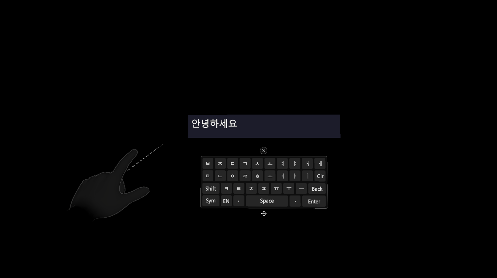

# MRTK Korean Keyboard

MRTK3 기반 **독립형 두벌식 한글 가상 키보드**. 월드 스페이스 캔버스, Grab 이동 핸들, `TMP_InputField` 자동 연동을 제공합니다.



> 위 이미지는 `Documentation~/images/example.png` 를 참조합니다. (`Documentation~` 폴더는 Unity가 import 하지 않으므로 스크린샷/문서용 이미지에 안전합니다.)

---

## 요구 사항

| 항목 | 비고 |
| --- | --- |
| Unity | 2022.3 LTS 권장 |
| **MRTK3** (선행 설치) | `org.mixedrealitytoolkit.core`, `org.mixedrealitytoolkit.uxcore`, `org.mixedrealitytoolkit.spatialmanipulation` |
| TextMeshPro | `com.unity.textmeshpro` (의존성 자동 설치) |
| XR Interaction Toolkit | `com.unity.xr.interaction.toolkit` (의존성 자동 설치) |

> ⚠️ MRTK3 는 Unity 기본 레지스트리에 없어 자동 설치되지 않습니다. **MRTK Feature Tool** 또는 **OpenUPM** 으로 먼저 설치하세요.

## 설치

### 방법 1 — Package Manager UI
`Window ▸ Package Manager ▸ + ▸ Add package from git URL...` 에 입력:

```
http://192.168.50.230:3000/PnCSolution/MRTKKeyboard.git
```

### 방법 2 — manifest.json 직접 편집
`Packages/manifest.json` 의 `dependencies` 에 추가:

```json
"com.pncsolution.mrtkkeyboard": "http://192.168.50.230:3000/PnCSolution/MRTKKeyboard.git"
```

특정 버전(태그) 고정: `...MRTKKeyboard.git#1.0.0`

## 빠른 시작

1. 씬에 빈 GameObject 를 만들고 **`KoreanKeyboardManager`** 컴포넌트를 추가합니다.
   - 또는 패키지의 `Prefabs/KeyboardManager.prefab` 을 씬에 드래그합니다.
2. `KoreanKeyboardManager` 의 **`Keyboard`** 슬롯에 `Prefabs/KoreanKeyboard.prefab` 을 지정합니다.
   - **프리팹**을 넣으면 → InputField 첫 선택 시 자동 생성됩니다.
   - **씬 인스턴스**를 넣거나 비워두면 → 씬에서 자동 탐색합니다.
3. 씬에 `EventSystem` + XRI `XRUIInputModule` 이 있어야 합니다(MRTK 리그에 보통 포함).
4. 실행 후 아무 **`TMP_InputField`** 를 선택하면 키보드가 사용자 정면에 떠서 입력이 연결됩니다.

키보드는 선택 시 사용자 정면에 1회 배치된 뒤 고정되며, 하단 **Grab 바**를 (레이/그랩으로) 잡아 위치를 옮길 수 있습니다.

## 입력 이벤트 연동 (중요)

키보드는 "입력 장치"로서 **현재 포커스된 `TMP_InputField` 로만** 라우팅합니다. 앱 로직은 키보드가 아니라 **각 InputField 의 이벤트**에 연결하세요:

```csharp
myInputField.onValueChanged.AddListener(text => { /* 입력 변경 */ });
myInputField.onSubmit.AddListener(text => { /* Enter 확정 */ });
```

이렇게 하면 여러 InputField 가 있어도 충돌 없이, 해당 필드가 비활성/파괴되면 핸들러도 함께 정리됩니다.

## 키 레이아웃

- 문자 페이지: 두벌식 자모(한글) ⇄ 영문 — `KR/EN` 토글, `Shift`(영문은 Caps 유지)
- 기호 페이지: `Sym` ⇄ `ABC`, `Shift` 로 보조 기호 세트 전환
- 기능: `Back`(분해 백스페이스), `Clr`(전체 지움), `Space`, `Enter`(줄바꿈 없이 `onSubmit` 호출), 좌상단 외부 닫기 버튼

## 폰트

`Fonts/Malgun SDF.asset`(맑은 고딕 동적 SDF, 한글 11,172자)이 포함됩니다. 직접 생성하려면 `Tools/ShareLens/Create Malgun TMP Font` 메뉴를 사용하세요.

> ⚠️ **라이선스**: 맑은 고딕은 © Microsoft 폰트로 재배포 제약이 있을 수 있습니다. 외부 공개 시 제거 후 오픈 폰트(Noto Sans KR, 나눔고딕 등)로 교체하세요. **내부 사용 한정.**

## 샘플 / 에디터 데모

- **예제 씬**: Package Manager 에서 이 패키지 선택 → **Samples ▸ "Demo Scene" ▸ Import** (`Samples~/Demo`). 키보드 + 데모 InputField 가 배치된 씬이 프로젝트로 복사됩니다. (MRTK 리그/EventSystem 선행 필요)
- `Tools/ShareLens/Create Demo InputField` — 월드 스페이스 데모 InputField 를 즉시 생성합니다.
- `Tools/ShareLens/Test Hangul Composer` — 두벌식 오토마타 스모크 테스트(15/15).

## 구성

| 폴더 | 내용 |
| --- | --- |
| `Runtime/` | HangulComposer, KoreanKey, KoreanKeyboard, KoreanKeyboardManager, MatchRectSize |
| `Editor/` | KeyboardDemoSetup, MalgunFontAssetBuilder, HangulComposerSmokeTest |
| `Prefabs/` | KoreanKeyboard, KeyboardManager, HangulKey |
| `Materials/` · `Fonts/` · `Sprites/` | 캔버스 머티리얼 / 폰트 / 아이콘 |

## 라이선스

`LICENSE.md` 참조. MRTK3 및 맑은 고딕 폰트는 각자의 라이선스를 따릅니다.
